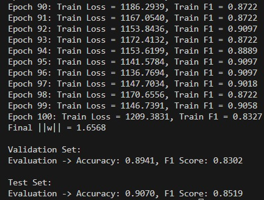
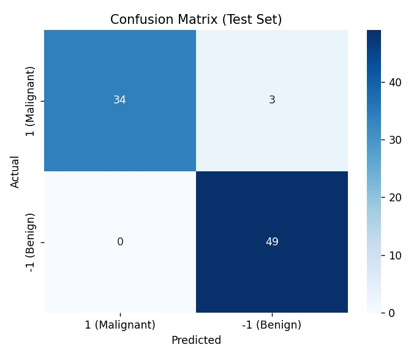
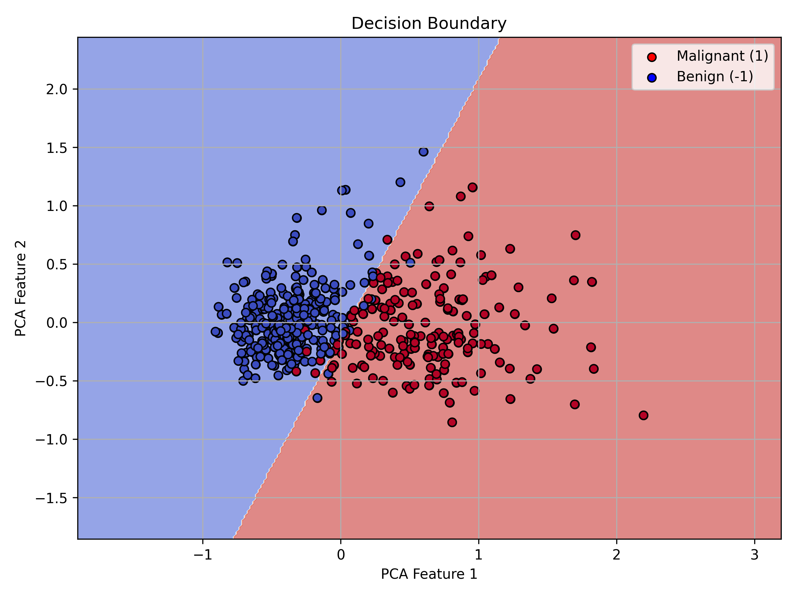

# SVM ile Meme Kanseri Teşhisi - Breast Cancer Wisconsin (Diagnostic) Dataset

Bu proje, **Support Vector Machine (SVM)** algoritması ile meme kanseri teşhisi yapmayı amaçlamaktadır. Kaggle üzerinden indirilen **Breast Cancer Wisconsin (Diagnostic)** veri seti kullanılarak, hem kütüphane kullanmadan, hem de `scikit-learn` gibi kütüphanelerle SVM sınıflandırma gerçekleştirilmiştir.

## Veri Seti Bilgisi

- **Kaynak**: [Kaggle - Breast Cancer Wisconsin (Diagnostic) Data Set](https://www.kaggle.com/datasets/uciml/breast-cancer-wisconsin-data)
- **Veri Sayısı**: 569 hasta
- **Özellik Sayısı**: 32 (1 ID, 1 Hedef Etiket, 30 Giriş Özelliği)
- **Hedef Etiket**: 
  - `M` → Malign (Kötü Huylu)
  - `B` → Benign (İyi Huylu)

> Özellikler, bir meme kitlesinin ince iğne aspirasyonunun (FNA) sayısallaştırılmış görüntüsünden hesaplanmıştır. Görüntüdeki hücre çekirdeklerinin sayısal özelliklerini içerir.

---

## SVM Algoritması Nedir?

**Support Vector Machine (SVM)**, sınıflandırma problemlerinde sıklıkla kullanılan denetimli bir makine öğrenmesi algoritmasıdır. Temel amacı, sınıflar arasındaki en büyük marjini sağlayan bir hiper düzlem bulmaktır.

- **Hinge Loss** fonksiyonu kullanılarak sınıflandırma hataları minimize edilir.
- **Regularization (Ceza Terimi)**, modelin aşırı öğrenmesini engellemek için kullanılır.
- Bu projede hem **kütüphanesiz (manual)** hem de **kütüphaneli (scikit-learn)** versiyonları uygulanmıştır.

---

## 🧪 Proje İçeriği

### 1. Kütüphanesiz SVM
- Python ile sıfırdan yazılmış SVM algoritması
- Eğitim (Train), Doğrulama (Validation) ve Test veri setlerinde performans sonuçları
- Eğitim süreci ekran çıktısı aşağıda yer almaktadır:

---

### 2. Kütüphaneli SVM (Scikit-learn)
- `sklearn.svm.SVC` ile implementasyon
- Özellik ölçekleme (`StandardScaler`)

- **Test verisi için karmaşıklık matrisi**:

- **Karar Sınırı Grafiği**:

> (Not: Karar sınırı grafiği sadece 2 boyutlu veri ile çizilebildiği için, PCA veya seçilmiş iki özellik üzerinden çizilmiştir.)

